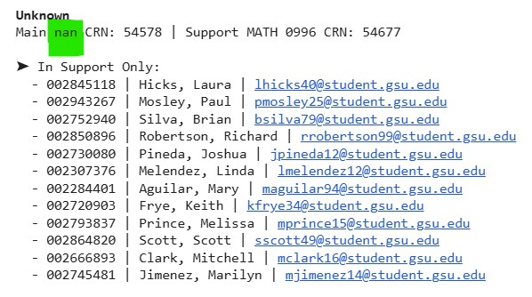

# 📘 Mismatched Support Rosters Reporting

> Identify and report mismatches between main and support course enrollments across campuses.

---

## 🔍 Overview
This reporting tool flags enrollment mismatches between co-requisite courses—such as MATH 1001 and its paired support course MATH 0997—by comparing CRN-linked class rosters. 

The notebook checks whether students enrolled in a main course are properly co-enrolled in its linked support course (and vice versa). Results are presented both in the Colab console and in a downloadable Excel report.

---

## 📥 Inputs
The notebook reads two CSVs hosted in the GitHub repository:

- **Class_Rosters_Demo.csv** – Contains student enrollment records with CRNs, IDs, names, and emails (synthesized)
- **Course_Schedule_Demo.csv** – Contains scheduled CRNs and comments fields with references to their paired support CRNs

These files are loaded using `pd.read_csv()` directly from the GitHub raw links.

---

## 🧪 What It Does
- Extracts CRN pairings from comments (e.g., "Students must also enroll in Math 09996 Support for Statistics: CRN 12345")
- Matches student rosters across each main-support CRN pair
- Flags students enrolled in one course but not its pair
- Adds campus info and subject numbers for context
- Prints formatted mismatch reports in the console
- Exports results to a timestamped Excel file

---

## 📤 Outputs
- ✅ **Console Report**: Highlighted mismatches by CRN and campus
- 📊 **Excel Report**: One sheet listing mismatched students, direction (Main Only / Support Only), and full enrollment info

Example output includes:
- CRN pair: Main MATH 1001 CRN 54751 (Alpharetta) | Support MATH 0997 CRN 54750 (Clarkston)
- Student mismatches: `In Main Only` or `In Support Only`

---

## 👩‍🏫 Intended Users
This tool is ideal for:
- Academic department schedulers
- Institutional research staff
- Program coordinators overseeing co-requisite models

---

## 🧰 Technologies Used
- Python (Colab environment)
- pandas
- xlsxwriter

> *Note: `faker` was used only to synthesize demo data and is not part of the actual reporting logic.*
> *No actual student names, emails or student IDs are used*

---

## 📸 Screenshots
| Console Report | 
|----------------|--------------|
|  | 

| Excel Report | 
 |

---

## 📁 Files in This Repo
- `Mismatched_Support_Rosters_Demo.ipynb` – Main notebook
- `Class_Rosters_Demo.csv` – Sample anonymized roster input
- `Course_Schedule_Demo.csv` – Sample schedule input
- `assets/` – Output samples screenshots

---

## 🚀 Get Started
1. Click the "Open in Colab" badge above
2. Run all cells
3. Download the Excel report at the end

---

## 📝 License
MIT License
